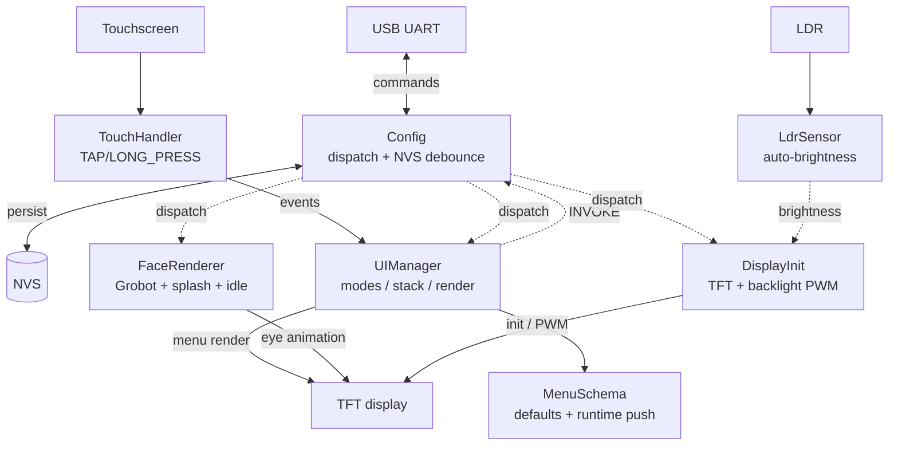

# CYD — Robot Study Companion firmware

Animated robot face with on-screen menus for the [Cheap Yellow Display](https://github.com/witnessmenow/ESP32-Cheap-Yellow-Display) (ESP32-2432S028R), part of the Robot Study Companion (RSC) project. Built on Grobot_Animations and TFT_eSPI, controlled over UART, configured at runtime, persistent across reboots.

---

## Features

- **Animated eyes** via [Grobot_Animations](https://github.com/tanmaywankar/Grobot_Animations) — spring physics, 10 preset moods, fine-tunable per-eye in real time
- **Two-mode UI** — FACE for the eye animation, MENU for on-screen settings; long-press toggles between them
- **Schema-driven menus** — declarative `MenuScreen` / `MenuItem` arrays in flash, with PUSH / INVOKE / BACK action kinds; menu actions invoke through the same dispatch table as serial commands
- **Runtime schema push** — `menu_begin` / `menu_screen` / `menu_item` / `menu_end` over UART loads a session-only menu without reflashing
- **UART command surface** — ~40 commands, dispatch-table parser, auto-generated `help` and `status`
- **NVS persistence with write debounce** — settable values survive reboot; writes batched after 5s of quiet to spare flash wear
- **LDR-driven auto-brightness** with continuous linear mapping and output-side smoothing
- **Random idle animation** — periodic cycling between IDLE1/2/3 moods when enabled
- **Touch event primitives** — TAP / LONG_PRESS state machine with drag-cancel
- **HUD overlay** (FPS counter), pause/resume, manual blink, canvas look-at, asymmetric eyes
- **Compile-time debug gates** for touch and LDR diagnostics
- **Git-describe versioning** baked at build time

---

## Hardware

- **Board:** ESP32-2432S028R (CYD original variant)
- **MCU:** ESP32-WROOM, no PSRAM, ~302 KB heap free at boot
- **Display:** ILI9341, 320×240 landscape, SPI at 55 MHz
- **Touch:** XPT2046 resistive on its own bitbanged bus (avoids HSPI collision)
- **LDR:** GPIO 34 (after reflow on this variant — most CYDs ship without a working LDR)
- **RGB LED:** GPIO 4 (R), 16 (G), 17 (B) — active low

### Pin mapping

| Signal | GPIO | Notes |
|--------|------|-------|
| TFT DC | 2 | |
| TFT CS | 15 | |
| TFT SCK | 14 | |
| TFT MOSI | 13 | |
| TFT MISO | 12 | |
| TFT Backlight | 21 | LEDC PWM, 5 kHz, 8-bit |
| Touch CS | 33 | |
| Touch IRQ | 36 | |
| LDR | 34 | ADC1, after hardware reflow |
| LED R / G / B | 4 / 16 / 17 | Active low |

---

## Software stack

| Component | Source | Pinned version |
|-----------|--------|----------------|
| PlatformIO platform | espressif32 | 6.4.0 |
| Arduino core | arduino-esp32 | 2.0.11 |
| Display driver | [bodmer/TFT_eSPI](https://github.com/Bodmer/TFT_eSPI) | 2.5.43 |
| Eye animations | [tanmaywankar/Grobot_Animations](https://github.com/tanmaywankar/Grobot_Animations) | 0.1.3 |
| Touch driver | [hexeguitar/CYD28_Touchscreen](https://github.com/hexeguitar/CYD28_Touchscreen) | bitbang fork |
| NVS | Built-in `Preferences` | — |

---

## Architecture

```
src/
  main.cpp           Pure orchestration — print*, init*, service*
  Config.cpp         Dispatch-table UART parser, NVS load/save with debounce
  FaceRenderer.cpp   Grobot wrapper, splash, mood/colour, pause/resume, idle cycling
  DisplayInit.cpp    TFT init, backlight PWM (LEDC channel 0)
  UIManager.cpp      Modes (FACE/MENU), screen stack, hit-testing, render
  MenuSchema.cpp     Default menu tables + runtime push parser
  DebugOverlay.cpp   Touch dots, edge detection, diag helpers
  LdrSensor.cpp      LDR sampling + continuous auto-brightness
  TouchHandler.cpp   initTouch, raw + event-style polls (TAP/LONG_PRESS)
  LED_Solution.cpp   RGB LED control

include/
  ... corresponding headers + version.h (auto-generated, gitignored)

scripts/
  version.py         git describe -> include/version.h, pre-build hook
```

The `Config` struct is the single source of truth for stateful settings. UART setters mark the config dirty; `serviceNvs()` flushes to NVS after a 5s debounce window (or immediately before reboot). `UIManager` owns mode and screen-stack state; menu actions invoke through the same dispatch table that handles typed serial commands, so adding a new UART command automatically makes it menu-capable.



The crucial connection is `UIManager -.INVOKE.-> Config`: menu actions and typed serial commands both flow through `findCommand()` and the dispatch table, so the menu surface automatically tracks any new UART command without separate wiring.

---

## UART command grammar

All commands travel over USB serial at **115200 baud**, newline-terminated.

- **Setter:** `key:value` — e.g. `mood:HAPPY`, `bright:50`, `eye_colour:00FF00`
- **Getter:** `key?` — e.g. `mood?`, `bright?`
- **Plain action:** `key` — e.g. `blink`, `clear`, `mem`

Type `help` for the full list. `status` prints all current settable values.

### Selected commands

| Command | Form | Example | Notes |
|---------|------|---------|-------|
| `mood` | setter+getter | `mood:HAPPY` | NEUTRAL, HAPPY, ANGRY, SAD, EXCITED, ANNOYED, QUESTIONING, IDLE1-3 |
| `mood_cycle` | toggle | `mood_cycle:on` | Auto-cycle through moods every 5–8s |
| `idle_anim` | toggle | `idle_anim:on` | Random IDLE1/2/3 every 5–15s when `mood_cycle` is off |
| `face` | setter+getter | `face:0,50,0,30,45` | Symmetric custom mood: topH,botH,tilt,pR,r |
| `face_l` / `face_r` | setter+getter | `face_l:0,30,0,30,45` | Per-eye asymmetric override |
| `look` | setter+getter | `look:30,-20` | Canvas offset (eye gaze direction) |
| `blink` | action | `blink` | Manual blink |
| `hud` | toggle | `hud:on` | FPS overlay (Grobot built-in) |
| `eye_colour` / `bg_colour` | setters | `eye_colour:00FF00` | RGB565, 6 hex digits |
| `bright` | setter+getter | `bright:50` | Manual backlight 0–100% |
| `auto_bright` | toggle | `auto_bright:on` | LDR-driven |
| `bright_light` / `bright_dark` | setters | `bright_dark:1` | Auto-brightness endpoints (1–100%) |
| `pause` / `resume` | actions | — | Freeze/unfreeze face renderer |
| `clear` | action | — | Wipe screen with background colour |
| `splash` | action | — | Re-show "RSC-CYD" splash |
| `tap` | action | `tap:160,120,1500` | Inject synthetic touch (debugging) |
| `led` | setter | `led:cyan` | RGB LED: off/on/red/green/blue/white/yellow/cyan/magenta or `r,g,b` |
| `mode` | setter+getter | `mode:MENU` | FACE / MENU; long-press is the touch-side equivalent |
| `menu` | action | `menu` | Print current screen + items |
| `menu_back` | action | — | Pop one menu level |
| `menu_select` | setter | `menu_select:0` | Select item by 0-based index |
| `menu_begin` / `menu_end` | actions | — | Start / finalise a runtime schema load |
| `menu_screen` | setter | `menu_screen:Custom` | Add a screen during runtime load |
| `menu_item` | setter | `menu_item:invoke,Brighter,bright:75` | `kind,label[,payload]` (kind = push/invoke/back) |
| `mem` / `uptime` / `version` | actions | — | Diagnostics |
| `ldr` / `light` / `lux` | actions | — | Light sensor readouts |
| `reboot` / `reset` | actions | — | Soft reboot / NVS wipe + reboot |

### Examples

```bash
# From a host machine over USB serial:
echo "mood:HAPPY" > /dev/ttyUSB0
echo "auto_bright:on" > /dev/ttyUSB0
echo "status" > /dev/ttyUSB0
```

```text
# Push a runtime menu over UART (overrides the compiled-in default for the session):
menu_begin
menu_screen:Custom
menu_item:push,Sub,1
menu_item:invoke,Bright max,bright:100
menu_item:back,Resume,
menu_screen:Sub
menu_item:invoke,Blink,blink
menu_item:back,Back,
menu_end
```

---

## Menus

Two top-level UI modes:

- **FACE** — animated eyes, splash, idle cycling, etc.
- **MENU** — on-screen menu, navigated by touch.

**Enter:** long-press (~1s) on the screen, or send `mode:MENU`.
**Navigate:** tap an item row to fire its action; tap a `BACK` row to pop one level.
**Exit:** popping past the root returns to FACE automatically, or long-press anywhere to exit immediately.

### Action kinds

Each `MenuItem` carries an `ActionKind`:

- **`PUSH`** — navigate into a sub-screen. Payload is a `MenuScreen*` (compiled-in) or a 0-based screen index (runtime-pushed schema).
- **`INVOKE`** — fire a UART command string (e.g. `"bright:75"`, `"blink"`). Routed through the same `findCommand()` path that handles typed serial input — no separate code paths.
- **`BACK`** — pop one screen off the stack.

### Default menu

Compiled into firmware (`src/MenuSchema.cpp`):

```
Menu
├── Brightness ▶  (25% / 50% / 75% / 100% / Back)
├── Mood ▶        (Neutral / Happy / Sad / Angry / Back)
├── Blink
└── Resume
```

### Runtime schema push

`menu_begin` … `menu_end` loads a session-only schema that replaces the active root for the rest of the session; reboot reverts to the compiled default. Bounds: 8 screens, 8 items per screen, ~1 KB pooled string storage. Items reference push targets by 0-based screen index in the schema being loaded.

---

## Building & flashing

```bash
git clone https://github.com/RobotStudyCompanion/CYD.git
cd CYD
pio run -t upload
pio device monitor
```

`pio device monitor` opens a serial console at the right baud. Type `help` once it boots.

---

## Debug builds

`platformio.ini` carries commented build flags for diagnostic features:

```ini
build_flags =
    ; -DTOUCH_DEBUG
    ; -DLDR_DEBUG
```

Uncomment to enable per-module Serial output. Defaults to silent for production builds.

For symbolised crash backtraces (instead of bare hex addresses), also uncomment:

```ini
monitor_filters = esp32_exception_decoder
```

---

## Versioning

Tags follow [SemVer](https://semver.org). The pre-build script `scripts/version.py` runs `git describe` and writes the result to `include/version.h`, so every binary reports its provenance over the `version` UART command:

- Tagged commit: `Firmware: v0.1.0`
- Untagged commit: `Firmware: v0.1.0-3-gabc123`
- Uncommitted changes: `Firmware: v0.1.0-3-gabc123-dirty`

---

## License

Apache 2.0 — see [LICENSE](LICENSE).

---

## Credits

- **Cheap Yellow Display** community, especially [witnessmenow](https://github.com/witnessmenow/ESP32-Cheap-Yellow-Display) for the platform reference
- **[Tanmay Wankar](https://github.com/tanmaywankar)** for Grobot_Animations
- **[Bodmer](https://github.com/Bodmer)** for TFT_eSPI
- **[hexeguitar](https://github.com/hexeguitar)** for the CYD touchscreen fork and the [LDR hardware mod reference](https://github.com/hexeguitar/ESP32_TFT_PIO#ldr)