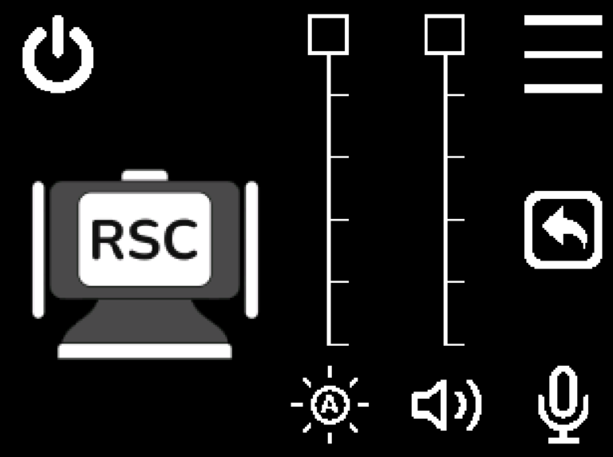
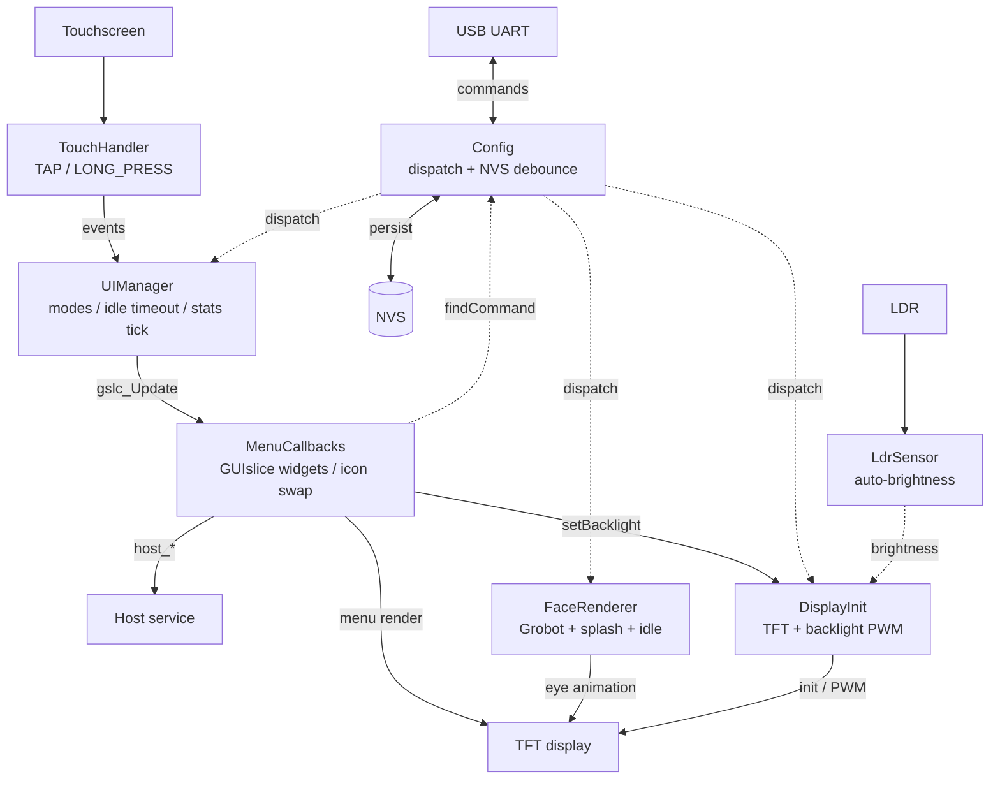
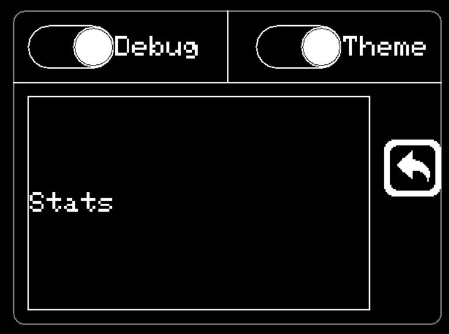
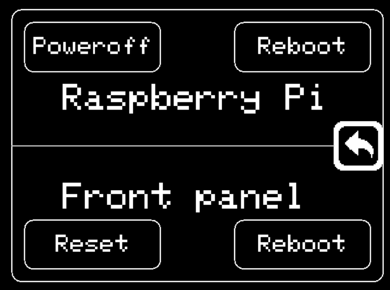
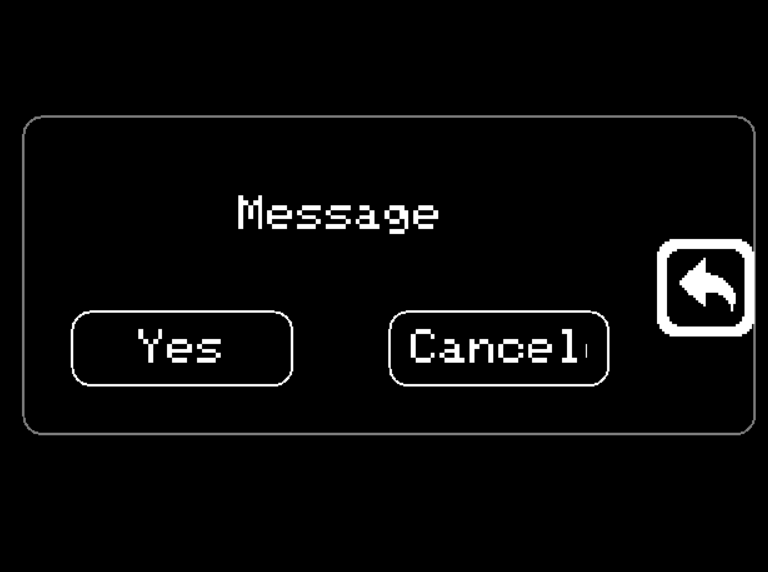

# CYD — Robot Study Companion firmware

[](https://opensource.org/licenses/Apache-2.0)
[](https://github.com/RobotStudyCompanion/CYD/tags)
[](https://github.com/RobotStudyCompanion/CYD/actions)


Animated robot face with on-screen touch menus for the [Cheap Yellow Display](https://github.com/witnessmenow/ESP32-Cheap-Yellow-Display) (ESP32-2432S028R), part of the Robot Study Companion (RSC) project. Acts both as a standalone animated companion and as a serial-controlled control surface for a host device (volume / mute / power / reboot). Built on Grobot_Animations, TFT_eSPI, and GUIslice; configured at runtime over UART, persistent across reboots.

<p align="center">
  
</p>

---

## Features

- **Animated eyes** via [Grobot_Animations](https://github.com/tanmaywankar/Grobot_Animations) — spring physics, 10 preset moods, fine-tunable per-eye in real time
- **Two-mode UI** — FACE for the eye animation, MENU for on-screen controls; long-press toggles into menu
- **GUIslice touch UI** built with the GUIslice Builder — main page with sliders and toggle icons, burger menu popup, power popup with destructive-action confirm dialog
- **Host control surface** — volume / mute / mic / power / reboot dispatched to host service over UART as `host_*` messages
- **UART command surface** — ~30 commands, dispatch-table parser, auto-generated `help` and `status`
- **NVS persistence with write debounce** — settable values survive reboot; writes batched after 5 s of quiet to spare flash wear
- **LDR-driven auto-brightness** with continuous linear mapping and output-side smoothing
- **Theme command** — `theme:light` / `theme:dark` preset pairs for background and eye colour; arbitrary colours still settable via `bg_colour` / `eye_colour`
- **Idle timeout** — menu auto-returns to face after configurable inactivity; disabled while touch debug is on
- **Random idle animation** — periodic cycling between IDLE1/2/3 moods when enabled
- **Touch event primitives** — TAP / LONG_PRESS state machine with drag-cancel; debug logging on state transitions (low-spam)
- **Live stats overlay** in the burger menu — firmware version, uptime, free heap; refreshes at 1 Hz while open
- **HUD overlay** (Grobot FPS counter), pause/resume, manual blink, canvas look-at, asymmetric eyes
- **Compile-time debug gates** for touch and LDR diagnostics
- **Git-describe versioning** baked at build time

---

## Hardware

- **Board:** ESP32-2432S028R (CYD original variant)
- **MCU:** ESP32-WROOM, no PSRAM, ~302 KB heap free at boot
- **Display:** ILI9341, 320×240 landscape, SPI at 55 MHz, mounted at rotation 3 (180° flipped for the enclosure)
- **Touch:** XPT2046 resistive on its own bitbanged bus (avoids HSPI collision)
- **LDR:** GPIO 34 (after reflow on this variant — most CYDs ship without a working LDR)
- **RGB LED:** GPIO 4 (R), 16 (G), 17 (B) — active low

### Pin mapping

| Signal | GPIO | Notes |
|--------|------|-------|
| TFT DC | 2 | |
| TFT CS | 15 | |
| TFT SCK | 14 | |
| TFT MOSI | 13 | |
| TFT MISO | 12 | |
| TFT Backlight | 21 | LEDC PWM channel 0, 5 kHz, 8-bit |
| Touch CS | 33 | |
| Touch IRQ | 36 | |
| LDR | 34 | ADC1, after hardware reflow |
| LED R / G / B | 4 / 16 / 17 | Active low |

---

## Software stack

| Component | Source | Version (tested) |
|-----------|--------|----------------|
| PlatformIO platform | espressif32 | 6.4.0 |
| Arduino core | arduino-esp32 | 2.0.11 |
| Display driver | [bodmer/TFT_eSPI](https://github.com/Bodmer/TFT_eSPI) | 2.5.43 |
| Eye animations | [tanmaywankar/Grobot_Animations](https://github.com/tanmaywankar/Grobot_Animations) | 0.1.3 |
| Touch driver | [hexeguitar/CYD28_Touchscreen](https://github.com/hexeguitar/CYD28_Touchscreen) | bitbang fork |
| UI framework | [ImpulseAdventure/GUIslice](https://github.com/ImpulseAdventure/GUIslice) | 0.17.2 |
| UI layout | GUIslice Builder | 0.17.b41 |
| NVS | Built-in `Preferences` | — |

---

## Architecture

```
src/
  main.cpp           Pure orchestration — print*, init*, service*
  Config.cpp         Dispatch-table UART parser, NVS load/save with debounce
  FaceRenderer.cpp   Grobot wrapper, splash, mood/colour, pause/resume, idle cycling
  DisplayInit.cpp    TFT init, backlight PWM (LEDC channel 0), reattach helper
  UIManager.cpp      FACE/MENU modes, long-press transitions, idle timeout, stats tick
  MenuCallbacks.cpp  GUIslice Builder output — button/slider callbacks, icon swap, stats refresh
  TouchHandler.cpp   initTouch, raw + event-style polls (TAP / LONG_PRESS), state-transition debug logging
  DebugOverlay.cpp   Touch dots, edge detection, diag helpers
  LdrSensor.cpp      LDR sampling + continuous auto-brightness
  LED_Solution.cpp   RGB LED control

include/
  test_GSLC.h        GUIslice Builder generated — element creation, page layout, image refs
  ... corresponding headers + version.h (auto-generated, gitignored)

scripts/
  version.py         git describe → include/version.h, pre-build hook
```

The `Config` struct is the single source of truth for stateful settings. UART setters and on-screen toggles both mark the config dirty; `serviceNvs()` flushes to NVS after a 5 s debounce window. `UIManager` owns mode and the menu lifecycle; `MenuCallbacks` (the GUIslice Builder output, hand-extended with state tracking and icon swap logic) handles all on-screen widget callbacks and routes through the same `findCommand()` dispatch table that handles typed serial input.



Adding a new UART command automatically makes it accessible from on-screen widgets, since menu callbacks invoke through the same dispatch table.

---

## On-screen UI

Three GUIslice pages plus a confirm popup, navigated entirely by touch.

<table align="center">
<tr>
<td align="center"></td>
<td align="center"></td>
<td align="center"></td>
</tr>
<tr>
<td align="center"><sub>Burger menu</sub></td>
<td align="center"><sub>Power popup</sub></td>
<td align="center"><sub>Confirm popup</sub></td>
</tr>
</table>

### Main page (`E_PG_MAIN`)

Default screen after long-pressing into menu mode.

| Element | Position | Action |
|---|---|---|
| Power button | top-left | Opens power popup |
| Burger menu button | top-right | Opens burger menu popup |
| RSC logo | centre-left | Returns to FACE mode |
| Back arrow | right-middle | Returns to FACE mode |
| Volume slider | right column | Posts `host_vol:NN` to UART (throttled to ~10 Hz) |
| Brightness slider | middle column | Sets local backlight via LEDC; broadcasts `bright:NN` (throttled) |
| Volume mute icon | below volume slider | Posts `host_mute`; icon swaps mute / low / loud based on slider level |
| Mic icon | below volume mute | Posts `host_mic`; icon swaps active / muted |
| Auto-brightness icon | below brightness slider | Toggles `auto_bright`; icon swaps manual / auto |

Sliders are inverted: top = max, bottom = min (matches the 180°-flipped enclosure mount).

### Burger menu (`E_PG_BURGER_MENU`)

Settings popup.

| Element | Action |
|---|---|
| Debug toggle | Flips `touch_debug` (also disables idle timeout while on) |
| Theme toggle | Flips `theme:light` / `theme:dark` |
| Stats text | Firmware version (tag + commits, `+` suffix if dirty), uptime, free heap — refreshes 1 Hz while open |
| Back arrow | Close popup |


### Power popup (`E_PG_PWR`)

2×2 grid for power actions, split by a horizontal line.

| Row | Left | Right |
|---|---|---|
| Raspberry Pi | Poweroff (destructive → confirm) | Reboot (recoverable) |
| Front panel (CYD) | Reset (destructive, wipes NVS → confirm) | Reboot (recoverable) |

Plus a back arrow to dismiss. Destructive actions route through a reusable confirm popup (`E_PG_POPUP_CONFIRM`) with Yes / Cancel; recoverable actions fire immediately.


### Mode transitions

| From | To | Trigger |
|---|---|---|
| FACE | MENU | Long-press (~1 s) anywhere |
| FACE | MENU | `mode:MENU` over serial |
| MENU | FACE | Tap RSC logo or back arrow on main page |
| MENU | FACE | Idle timeout (default 10 s, configurable via `menu_timeout`) |
| MENU | FACE | `mode:FACE` over serial |

Idle timeout is suspended while `touch_debug:on` — useful when debugging touch coordinates without the menu closing on you.

---

## UART commands

All commands travel over USB serial at **115200 baud**, newline-terminated.

- **Setter:** `key:value` — e.g. `mood:HAPPY`, `bright:50`, `eye_colour:00FF00`
- **Getter:** `key?` — e.g. `mood?`, `bright?`
- **Plain action:** `key` — e.g. `blink`, `clear`, `mem`

Type `help` for the full list. `status` prints all current settable values.

Boolean values accept any of: `on`/`off`, `true`/`false`, `yes`/`no`, `1`/`0` (case-insensitive).

### Selected commands

| Command | Form | Example | Notes |
|---------|------|---------|-------|
| `mood` | setter+getter | `mood:HAPPY` | NEUTRAL, HAPPY, ANGRY, SAD, EXCITED, ANNOYED, QUESTIONING, IDLE1-3 |
| `mood_cycle` | toggle | `mood_cycle:on` | Auto-cycle through moods every 5–8 s |
| `idle_anim` | toggle | `idle_anim:on` | Random IDLE1/2/3 every 5–15 s when `mood_cycle` is off |
| `theme` | setter+getter | `theme:dark` | `light` (white bg / black eyes) or `dark` (black bg / white eyes) |
| `face` | setter+getter | `face:0,50,0,30,45` | Symmetric custom mood: topH,botH,tilt,pR,r |
| `face_l` / `face_r` | setter+getter | `face_l:0,30,0,30,45` | Per-eye asymmetric override |
| `look` | setter+getter | `look:30,-20` | Canvas offset (eye gaze direction) |
| `blink` | action | `blink` | Manual blink |
| `hud` | toggle | `hud:on` | FPS overlay (Grobot built-in) |
| `eye_colour` / `bg_colour` | setters | `eye_colour:00FF00` | RGB565, 6 hex digits; aliases `eye_color` / `bg_color` |
| `bright` | setter+getter | `bright:50` | Manual backlight 1–100 % |
| `auto_bright` | toggle | `auto_bright:on` | LDR-driven |
| `bright_light` / `bright_dark` | setters | `bright_dark:1` | Auto-brightness endpoints (0–100 %) |
| `menu_timeout` | setter+getter | `menu_timeout:30` | Idle timeout in seconds (0 = disabled) |
| `touch_debug` | toggle | `touch_debug:on` | State-transition debug logging on touch events |
| `touch_dots` | toggle | `touch_dots:on` | Visual touch dots on screen |
| `pause` / `resume` | actions | — | Freeze / unfreeze face renderer |
| `clear` | action | — | Wipe screen with background colour |
| `splash` | action | — | Re-show "RSC-CYD" splash |
| `tap` | action | `tap:160,120,1500` | Inject synthetic touch (debugging) |
| `led` | setter | `led:cyan` | RGB LED: off/on/red/green/blue/white/yellow/cyan/magenta or `r,g,b` |
| `mode` | setter+getter | `mode:MENU` | FACE / MENU; long-press is the touch-side equivalent |
| `menu` | action | `menu` | Print current menu state |
| `menu_back` | action | — | Exit menu (returns to FACE) |
| `mem` / `uptime` / `version` | actions | — | Diagnostics |
| `ldr` / `light` / `lux` | actions | — | Light sensor readouts |
| `reboot` / `reset` | actions | — | Soft reboot / NVS wipe + reboot |

### Examples

```bash
# From a host machine over USB serial:
echo "mood:HAPPY" > /dev/ttyUSB0
echo "theme:dark" > /dev/ttyUSB0
echo "auto_bright:on" > /dev/ttyUSB0
echo "status" > /dev/ttyUSB0
```

---

## Host serial contract

When the user interacts with on-screen widgets whose state lives on the host (volume, mute, mic, power), the firmware emits short uppercase-namespaced messages over UART. A host service is expected to consume these.

| Message | Trigger | Notes |
|---|---|---|
| `host_vol:NN` | Volume slider drag | NN in 0–100; throttled to ~10 Hz during drag |
| `host_mute` | Volume mute icon tap | Idempotent toggle request; CYD does not track audio mute state |
| `host_mic` | Mic icon tap | Idempotent toggle request; CYD does not track mic state |
| `host_reboot` | Pi Reboot menu button | Recoverable; no confirmation needed |
| `host_poweroff` | Pi Poweroff menu button | Confirmed through the Yes/Cancel popup before emission |

The CYD does not parse these messages back, so a host that echoes them won't loop.

---

## Building & flashing

```bash
git clone https://github.com/RobotStudyCompanion/CYD.git
cd CYD
pio run -t upload
pio device monitor
```

`pio device monitor` opens a serial console at the right baud. Type `help` once it boots.

### CI build status (optional)

The build shield in the header references a GitHub Actions workflow. A minimal workflow that runs `pio run` on push:

```yaml
# .github/workflows/build.yml
name: build
on: [push, pull_request]
jobs:
  build:
    runs-on: ubuntu-latest
    steps:
      - uses: actions/checkout@v4
      - uses: actions/setup-python@v5
        with: { python-version: '3.x' }
      - run: pip install platformio
      - run: pio run
```

Once committed under `.github/workflows/build.yml`, the shield will reflect the latest run.

---

## Debug builds

`platformio.ini` carries commented build flags for diagnostic features:

```ini
build_flags =
    ; -DTOUCH_DEBUG
    ; -DLDR_DEBUG
```

Uncomment to enable per-module Serial output. Defaults to silent for production builds.

Runtime debug is also available without rebuilding:

```bash
echo "touch_debug:on" > /dev/ttyUSB0    # state-transition logging on touch
echo "touch_dots:on"  > /dev/ttyUSB0    # visual touch dots on screen
```

Symbolised crash backtraces (instead of bare hex addresses) are enabled by default via `monitor_filters = esp32_exception_decoder` in `platformio.ini`. Comment it out if you want raw addresses.

---

## Versioning

Tags follow [SemVer](https://semver.org). The pre-build script `scripts/version.py` runs `git describe` and writes the result to `include/version.h`, so every binary reports its provenance over the `version` UART command and on the in-menu stats overlay:

- Tagged commit: `Firmware: v0.3.0`
- Untagged commit: `Firmware: v0.3.0-3-gabc123`
- Uncommitted changes: `Firmware: v0.3.0-3-gabc123-dirty`

The on-screen stats overlay shortens the version to the tag + commits-since portion and appends a `+` if the working tree was dirty at build.

---

## License

Apache 2.0 — see [LICENSE](LICENSE).

---

## Credits

- **Cheap Yellow Display** community, especially [witnessmenow](https://github.com/witnessmenow/ESP32-Cheap-Yellow-Display) for the platform reference
- **[Tanmay Wankar](https://github.com/tanmaywankar)** for Grobot_Animations
- **[Bodmer](https://github.com/Bodmer)** for TFT_eSPI
- **[hexeguitar](https://github.com/hexeguitar)** for the CYD touchscreen fork and the [LDR hardware mod reference](https://github.com/hexeguitar/ESP32_TFT_PIO#ldr)
- **[ImpulseAdventure](https://github.com/ImpulseAdventure)** for GUIslice and the GUIslice Builder layout tool